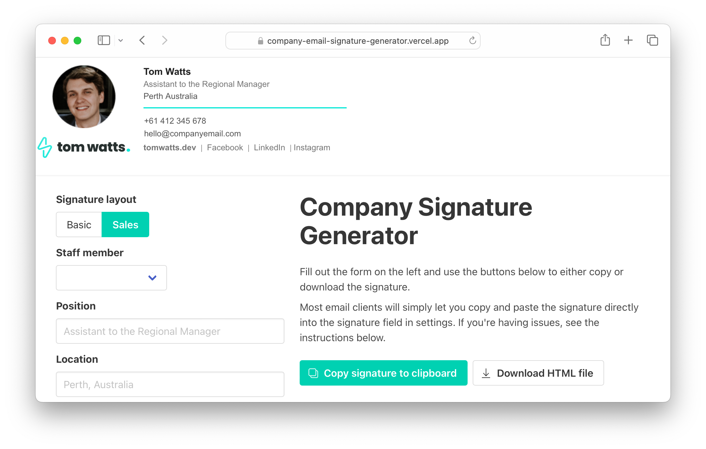

<p align="center">
  Live example: <a href="https://company-email-signature-generator.vercel.app/">company-email-signature-generator.vercel.app</a>
</p>
<p align="center">
  
</p>

An email signature generator designed to be configured for use within companies to help keep signatures consistent. Comes with 2 clean and simple layouts.

Built in [Vue 3](https://v3.vuejs.org/) and [Bulma](https://bulma.io/).

## Install and run locally
```bash
yarn
yarn dev
```

## Build for production
```bash
yarn build
```
##

Created by [Tom Watts](https://tomwatts.dev)
